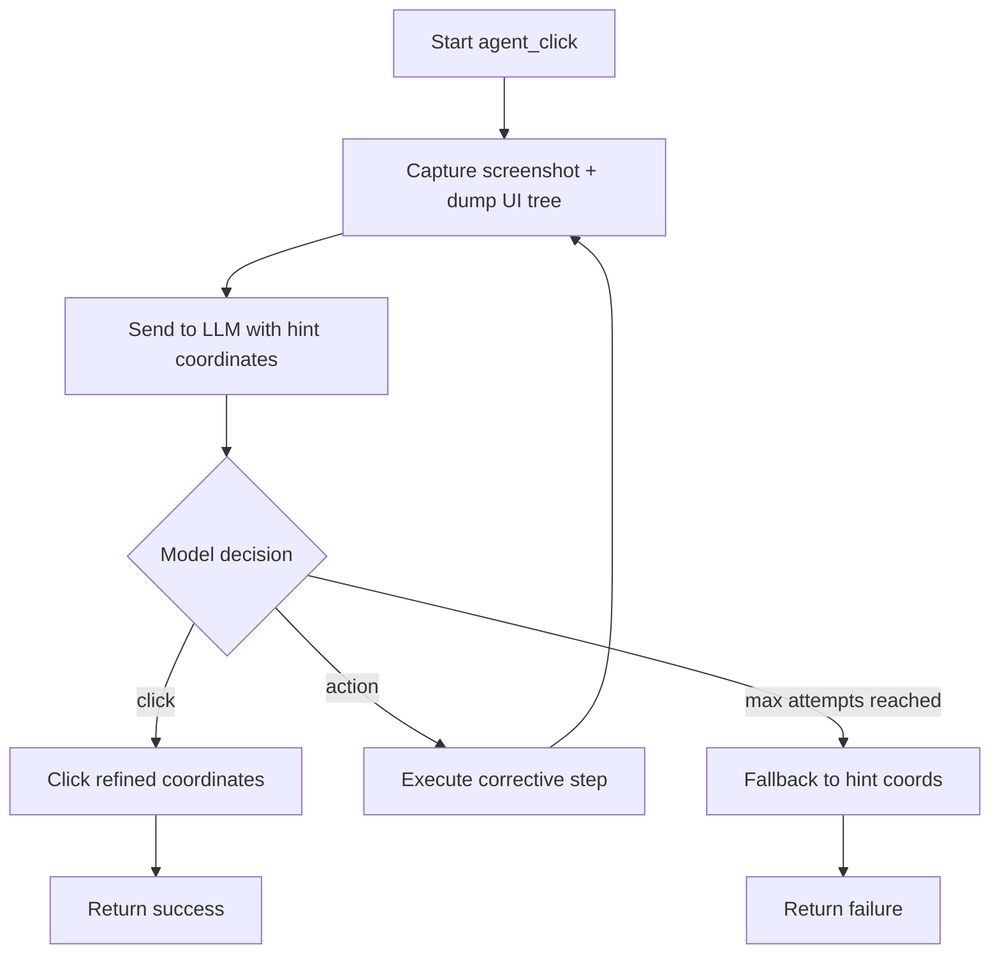

# Architecture

This document describes the high-level architecture of **Auto Test Android**, a
vision-based Android UI automation framework.

## Overview

The framework automates Android UI interactions by combining two sources of
perception:

1. **Screenshots** — captured via `adb exec-out screencap -p`.
2. **Accessibility tree** — parsed from a `uiautomator dump` XML.

Both are sent to a multimodal LLM, which decides the next action. This hybrid
approach is far more robust than hardcoded coordinates, because the model can
locate elements dynamically and recover from overlays, popups or layout changes.

## Components

### `job_runner.py` — Entry point

Thin entry point for the **job-processing (polling) mode**. It:

- Selects the ADB device.
- Polls a backend API for pending jobs.
- Delegates each job to `job_processor.process_job()`.

### `job_processor.py` — Orchestration

Handles the end-to-end lifecycle of a job:

1. Downloads the video and JSON metadata from the backend API.
2. Pushes both files to the Android device via `adb push`.
3. Broadcasts a `MEDIA_SCANNER_SCAN_FILE` intent so the gallery sees the file.
4. Runs each platform uploader in sequence.
5. Generates a Markdown guide of the executed steps.
6. Cleans up temporary local files.

### `platforms/` — Upload automations

Each platform is a subclass of `BaseUploader`:

| Module | Class | Platform |
|--------|-------|----------|
| `platforms/tiktok.py` | `TikTokUploader` | TikTok |
| `platforms/instagram.py` | `InstagramUploader` | Instagram |
| `platforms/youtube.py` | `YouTubeUploader` | YouTube Studio |

Each uploader implements `upload(video_path, metadata)`, which drives the UI
through the shared helpers in `ui_automator`.

### `ui_automator.py` — Shared UI helpers

Centralizes the vision-based agent logic and the text-input helpers. Low-level
ADB operations are delegated to a single `ADBController` instance (the single
source of truth for device interaction):

- `adb()` — send native ADB commands (via `ADBController`).
- `touch_relative()` / `get_screen_size()` — coordinate helpers.
- `parse_ui_tree()` — parse a UIAutomator XML dump into a compact element summary.
- `type_text()` / `clean_text()` / `hide_keyboard()` — text input helpers.
- `agent_click()` — the vision-based click loop (see below).
- `wake_and_unlock()` — device wake/unlock.

### `adb_controller.py` — ADB wrapper

Thin wrapper around the `adb` command-line tool. It routes every command to a
single device (identified by `device_id`) and exposes high-level operations
such as `click()`, `swipe()`, `type_text()`, `take_screenshot()` and
`dump_ui_tree()`. It is used by `ui_automator`.

### `llm_provider.py` — Provider abstraction

Defines `BaseLLMProvider` with a single method `analyze_screen()`. Concrete
implementations:

- `OpenAICompatibleProvider` — works with NVIDIA NIM and Cerebras.
- `GoogleGenAIProvider` — works with Google Gemini.

This makes it trivial to add new providers.

**Zero-cost default:** the provider bootstrap in `ui_automator.init_agent_llm()`
prioritizes NVIDIA NIM, whose free tier lets the pipeline run without paying
for inference. Note that the free tier is subject to NVIDIA NIM terms of
service (rate limits, model availability, evaluation intent, data handling, no
SLA) — see the README for details.

### `step_recorder.py` — Documentation

Records every executed step and generates a Markdown guide at the end of a job.
This is useful both for debugging and for producing human-readable reports.

## The vision-based click loop

`agent_click()` is the heart of the framework. Given a target element described
in natural language and a rough coordinate hint, it:

1. Captures a screenshot and dumps the UI tree.
2. Sends both to the LLM with a prompt asking for a JSON decision.
3. If the model returns `{"status": "click", ...}`, it clicks the refined
   coordinates and returns success.
4. If the model returns `{"status": "action", ...}`, it executes a corrective
   step (click elsewhere, swipe, press key, wait) and loops again.
5. After `max_attempts`, it falls back to the original hint coordinates.



## Configuration flow

All configuration is centralized in `config.py`, which reads from environment
variables (loaded from `.env` via `python-dotenv`). API keys are never
hardcoded in source code.

```
.env  ──►  config.py  ──►  llm_provider.py / ui_automator.py / job_processor.py
```

## Extending the framework

To add a new platform (e.g. Facebook):

1. Create `platforms/facebook.py` with a `FacebookUploader(BaseUploader)`.
2. Implement `upload(video_path, metadata)` using the helpers in `ui_automator`.
3. Register it in `platforms/__init__.py`.
4. Optionally add it to the uploader list in `job_processor.process_job()`.
